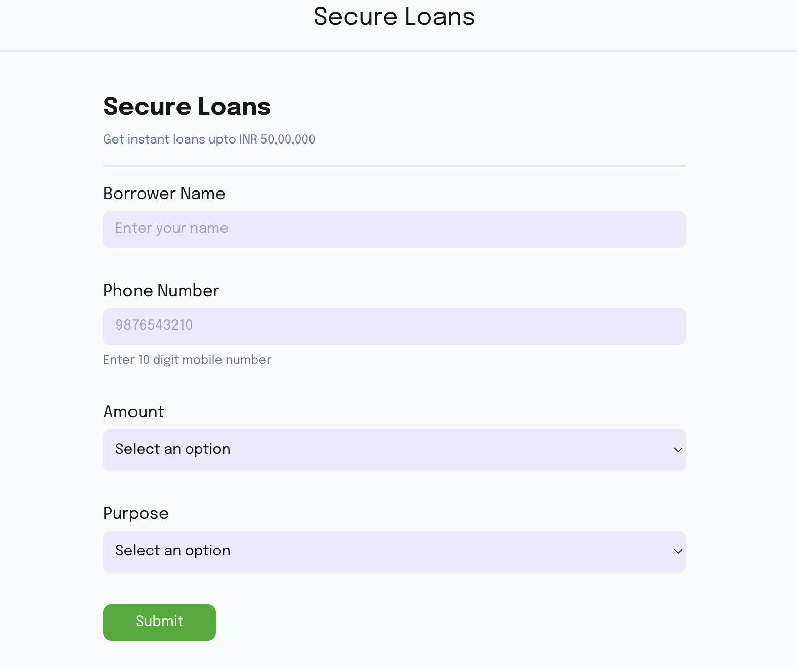
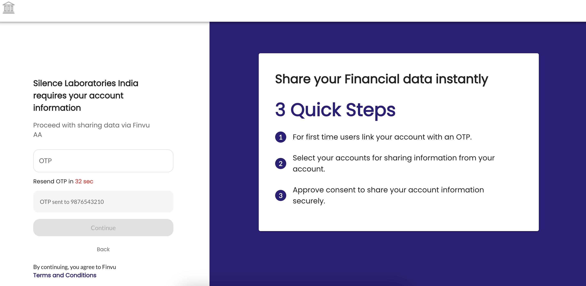
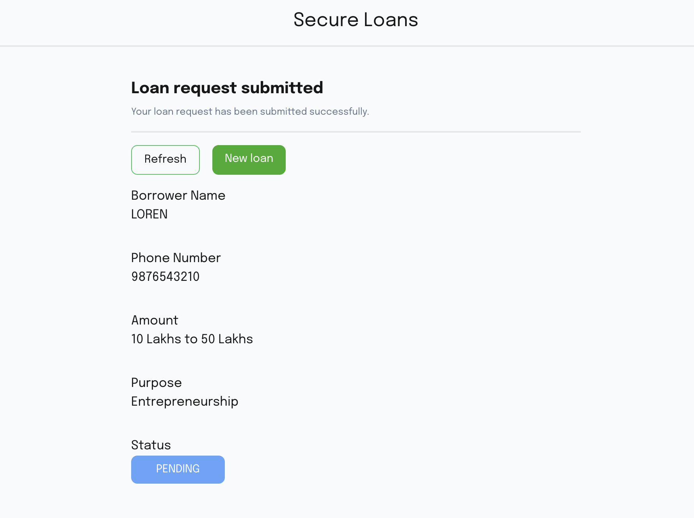
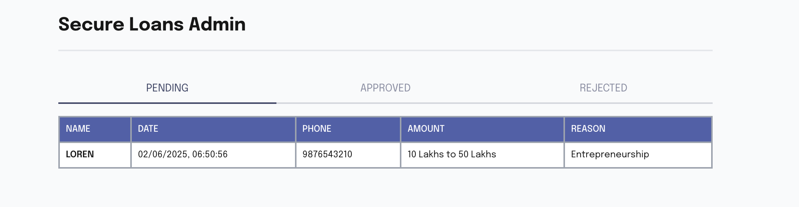
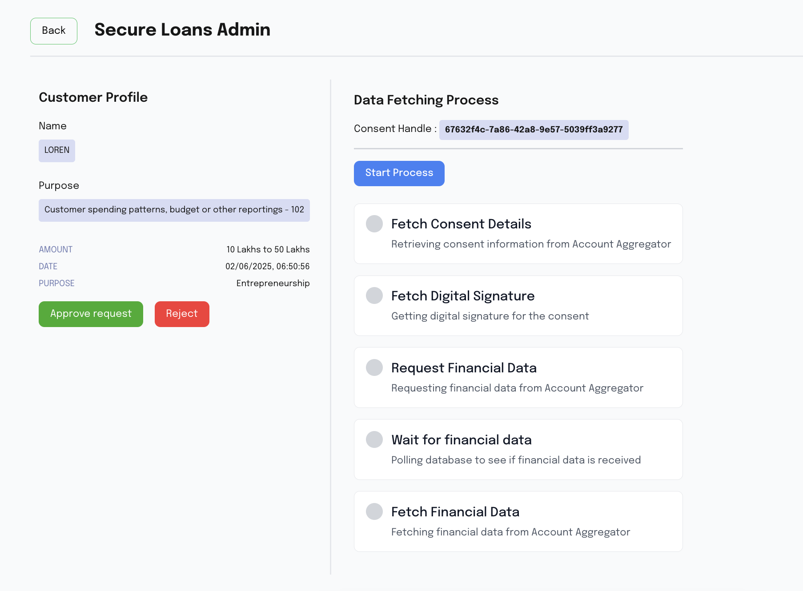

# Secure Loans

### Example flow
Secure Loans is a loan application platform, a FIU, that integrates with multiple Account Aggregator (AA) services to fetch financial data for loan underwriting.

## Services Used

### Supabase
Supabase is used as a simple database for user and data management

#### Setup

Create a project on Supabase. You can [follow this guide](https://supabase.com/docs/guides/api/quickstart) to setup Supabase

Create two tables `encryption_keys` and `user`

```sql
create table public.encryption_keys (
  created_at timestamp with time zone not null default now(),
  fiu_encryption_key jsonb null,
  fip_encryption_key jsonb null,
  is_data_ready boolean null,
  session_id uuid not null,
  fiu_private_key jsonb null,
  constraint encryption_keys_pkey primary key (session_id),
  constraint encryption_keys_session_id_key unique (session_id)
) TABLESPACE pg_default;
```

```sql
create table public.user (
  id bigint generated by default as identity not null,
  created_at timestamp with time zone not null default now(),
  name character varying null,
  amount character varying null,
  phone text null,
  purpose character varying null,
  "loanStatus" text null,
  "consentHandle" text null,
  "linkRefNumbers" jsonb null,
  "consentStatus" text null default 'PENDING'::text,
  "dataStatus" text null default 'PENDING'::text,
  "insightsStatus" text null default 'PENDING'::text,
  "sessionId" text null,
  constraint user_pkey primary key (id)
) TABLESPACE pg_default;
```

##### Configuration:

Use the below configuration in constants of both frontend (constants.ts) and backend (constants.py) repos

```
SUPABASE_URL=your_supabase_url
SUPABASE_KEY=your_supabase_key
```

### Finvu AA Integration

This repo consists of Finuv AA integration on Sandbox to help understand the flow better.

`silence-fiu` is a registered FIU entity with SahamatiNet sandbox

We integrated with Finvu AA on sandbox to facilitate end-to-end testing

`constants.py` file in util folder needs to be updated with relevant details of the FIU that is testing.

`CLIENT_ID`, `CLIENT_SECRET`, `PUBLIC_KEY`, `PRIVATE_KEY` , `USERNAME` and `PASSWORD` needs to filled with relevant details of a FIU.

The above details can be obtained by registering on SahamatiNet sandbox and registering a FIU entity on sandbox. You can read more about it [here](https://developer.sahamati.org.in/sahamatinet-poc/integration-steps/sandbox-onboarding)

### Documentation for UI flow

#### User flow

User lands on the loan request page to provide details of the loan required




Secure Loans redirects the user to AA Consent screens to review details and select accounts to share data with FIU




Once consent is approved, user is redirected to the status page.




#### Admin flow

Admin can now review user data to approve or reject loan

List of all loan requests



Dashboard where Admin can trigger the data fetch and insight generation

During this process, replicate the FI notification flow from AA to FIU by making a request to `/FI/Notification` endpoint. Copy the `sessionId` from the dashboard and replace the value in Postman.

You can refer about it here

##### FI notification

Once the request for FI is succesfully raised, we'll receive a notification on the `baseURL/FI/Notification` endpoint from Finvu. This provides us the status of FI data. We can now fetch the FI data based on the notification data 



### Documentation for API flow

Follow the flow in this order

Step 1: Make a request to the Create Consent API to initiate a consent request.
Step 2: Make a request to get the redirection URL of AA for the end-user
Step 2: Use the consent handle received from the previous step to make a POST request to the Consent Handle API.
Step 3: Fetch the consent details using the Consent Fetch API.
Step 4: Initiate an FI request using the FI Request API with the necessary consent details (consentId and digitalSignature).
Step 6: Fetch the encrypted FI data using the FI Fetch API.

##### Create Consent API

Endpoint: `/api/v1/create-consent`

Method: POST

Description: This endpoint is used to create a consent request. It requires your mobile number as input to receive OTPs from AA.
Response: Returns the consent handle of the consent

##### Get Redirection URL API

Endpoint: `/api/v1/get-redirection-url`

Method: POST

Description: This endpoint is used to create a redirection URL to the AA for the end-user to review the consent request. It requires mobile number and the consent handle received in the Create Consent call as input
Response: Returns the redirection URL


##### Account linking and approval

Click on the URL generated, you should visit the AA consent manager. Login and search for `Setu FIP` and  choose `Setu FIP` as your bank/financial institution.

Once selected, you'll be displayed multiple bank accounts to select from. Please select only the Savings accounts which is not a `FAILURE` in the list.

You'll receive an OTP from Setu to link that one Savings account. After linking, you can continue to approval and consent manager redirects you to the FIU app.


##### Consent Handle API:

Endpoint: `/api/v1/consent-handle`

Method: POST

Description: This endpoint processes a consent handle. The request body must include a consentHandle.
Response: Returns the consent details along with the consentId

##### Consent Fetch API

Endpoint: `/api/v1/consent-fetch`

Method: POST

Description: This endpoint fetches consent details. The request body must include a consentId.
Response: Returns the consent details with the consentId and digitalSignature

##### FI Request API

Endpoint: `/api/v1/fi-request`

Method: POST

Description: This endpoint initiates a financial information (FI) request. The request body must include a consentId and a digitalSignature. We generate the FIP encryption key and sessionId. We save them in a DB table with sessionID being the primary key. Using these values, update the mock response for this scenario
Response: Returns the FI request response.

##### FI notification

Once the request for FI is succesfully raised, we'll receive a notification on the `baseURL/FI/Notification` endpoint from Finvu. This provides us the status of FI data. We can now fetch the FI data based on the notification data

##### FI Fetch API

Endpoint: `/api/v1/fi-fetch`

Method: POST

Description: This endpoint fetches financial information. The request body must include a sessionId.
Response: Returns the FI fetch response.

You can find the Postman collection and environment [here](https://documenter.getpostman.com/view/13895199/2sB2qdh1Bq)

## Project Structure

### Frontend
- Next.js application
- Supabase client integration
- Dynamic consent flow UI
- Admin dashboard for loan management

### Backend
- Flask API server
- Integration with Setu and Mock AA services
- Encryption handling
- Session management

## Setup Instructions

### Frontend Setup
1. Install dependencies:
   ```bash
   cd frontend
   npm install
   ```

2. Configure constants.ts:
   ```
   SUPABASE_URL=your_supabase_url
   SUPABASE_KEY=your_supabase_key
   BACKEND_URL=your_backend_url
   ```

3. Run the development server:
   ```bash
   npm run dev
   ```

### Backend Setup
1. Create and activate virtual environment:
   ```bash
   cd backend
   python3 -m venv .fiu
   source .fiu/bin/activate
   ```

2. Install dependencies:
   ```bash
   pip install -r requirements.txt
   ```

3. Run the server:
   ```bash
   python main.py
   ```

## Security
- All API keys and secrets should be stored securely
- Use environment variables for sensitive data
- Implement proper encryption for data transfer
- Follow security best practices for key management

## License
MIT License
